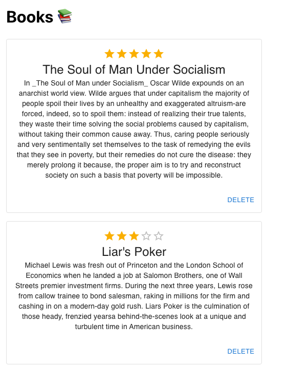

# bookshop-monorepo

A sample monorepo with multiple services for running a bookshop inventory, including:
- REST API (written in Spring) 
- Database (powered by Postgres)
- CLI (written in Golang)
- Frontend (written in Javascript/React)
- Book sorting (written in Scala)
- Fetch data from Goodreads (written in Python)




## Set up development environment:

### Coder

[](https://sandbox.coder.com/wac/build?template_oauth_service=github&template_url=https://github.com/bpmct/bookshop-monorepo&template_ref=main&template_filepath=.coder/coder.yaml)

```
1) Navigate to your Coder deployment
2) New Workspace > From template

Repository URL: https://github.com/bpmct/bookshop-monorepo
Branch: main
Template: .coder/coder.yaml
```

### Or (manual):

#### Clone the repository on your local machine

- Ensure you have SSH and GPG keys set up.

```sh
ssh git@github.com:bpmct/bookshop-monorepo.git
```

#### Install a Postgres server

Run [this init script](./infrastructure/aws//store-api/userdata.tpl). Ensure you have `bookstore` database and there is no password for the `postgres` user

#### Install Bazel

Follow the [Bazel docs](https://docs.bazel.build/versions/master/install.html) to install on your machine. You MUST have version `4.10.0`

#### Python 3.10

#### NodeJS and Yarn

You need NodeJS 16.x and yarn installed on your machine

#### DevOps tools

- Install `aws-cli`, `terraform`, `zstd` on your machine

## Credits

This is a fork of [thundergolfer/example-bazel-monorepo](https://github.comthundergolfer/example-bazel-monorepo).
